# rf-nano  [中文版](./README_ZH.md)
[**AliExpress purchase link**](https://www.aliexpress.com/item/1005005472547279.html?pdp_npi=3%40dis%21USD%21US%20%245.25%21US%20%244.93%21%21%21%21%21%4021038dc816846695615375838d035d%2112000033220158732%21sh01%21CN%212613261194&spm=a2g0o.store_pc_home.productList_2005072051256.subject_1&gatewayAdapt=4itemAdapt )

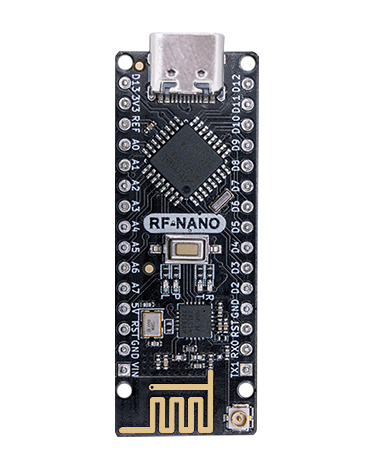

# Introduction

​		rf-nano is a 2.4G wireless development board developed by emakefun company, integrating the nrf24L01+ wireless chip based on the official standard Arduino Nano V3.0 motherboard. Its size and pins are fully compatible with the standard Nano V3.0 development board, directly compatible with the[RF24 open source library](https://github.com/maniacbug/RF24),can be set for power consumption, transmission rate, channel, etc., and supports Mixly, Mblock5, Magicblock visual programming. The onboard antenna is optimized for transmission distance up to 30m, with a onboard IPEX patch antenna socket, and an external antenna can achieve a transmission distance of up to 100m.

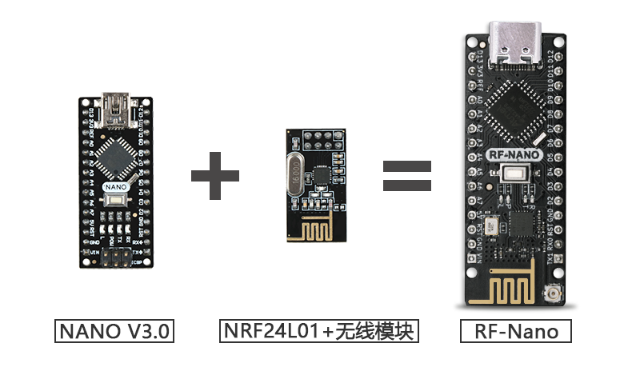

### Main Technical Parameters

- Processor:ATmega328P-AU 
- Operating Voltage: 5V recommended, VIN Input Voltage: 6V ~ 15V
- Digital I/O Pins: 22 (6 of which are used for PWM output)
- Analog Input Pins: 8 (A0~A7).
- DC Current of I/O Pin:40mA 
- Current of 5V Pin: 1000mA when VIN is connected.
- Current of by 3.3V Pin: 50mA.
- Flash Memory: 32KB (with 0.5KB dedicated to bootloading program). 
- SRAM: 2KB
- EEPROM: 1KB
- USB to Serial Chip: CH340G with external crystal.
- Clock Speed: 16 MHz

## Upgrade points for the version

Comparison of product parameters between Nano V3.0, RF-Nano V1.0 V2.0, and RF-Nano V3.0

|  Function  | NANO   3.0 | RF-NANO (Old version V1.0 V2.0) |RF-NANO (New version V3.0)  |
|  :--:  | :--:  |:--:  |:--:  |
| product picture | 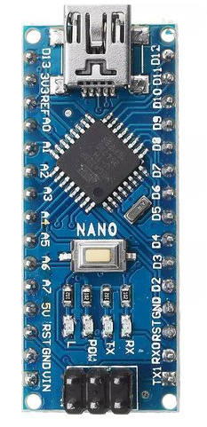 | 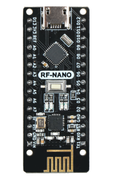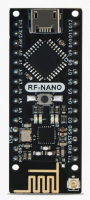 |  |
| Main control chip | ATmega328P-AU | ATmega328P-MU | ATmega328PB-AU |
| USB interface | Mini USB | Micro USB |Type-C  |
| Size  | 18mm x 45mm | 19mm x 49mm |18mm x 48mm  |
| Pin sequence | - | Not compatible with RF24 library(10，9，11，12，13) |Compatible with RF24 library(7，8，11，12，13)  |
| External antenna | - | None  |Yes   |

**Note**：Besides upgrading the functional points, the PCB layout of rf-nano 3.0 has also been newly optimized with careful arrangement. In addition, the power devices and peripheral devices have also been fully optimized, using well-known original chips to greatly improve the overall RF performance and product stability.

rf-nano V1.0 has long been discontinued, but there are still many V1.0-shaped boards on the market that are all clone versions with rough workmanship and many refurbished materials. The quality is unreliable, so please be aware and distinguish carefully.

## Switching between On-board Antenna and IPEX External Antenna

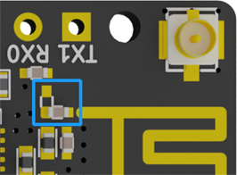                                                           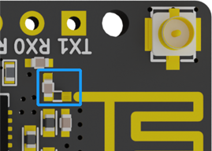

​						On-board antenna																						External Antenna

**Note: If the capacitor in the blue area in the picture is horizontally soldered, the on-board antenna is being used. If it is vertically soldered, the external antenna is being used. To switch the antenna, simply modify the direction of the soldering of the capacitor in the blue area of the picture.**


## Pin diagram

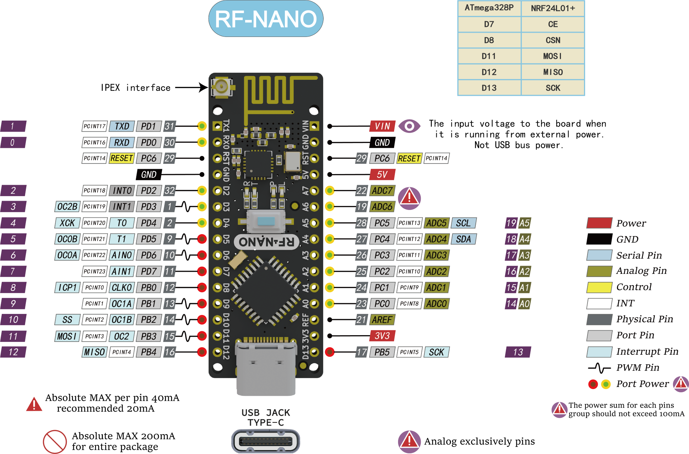

## Schematic diagram

[schematic diagram download ](schematic/rf-nano_sch_v3.0.pdf)

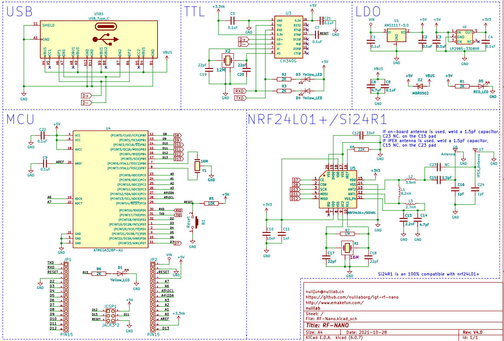


## Mechanical dimensions labeling

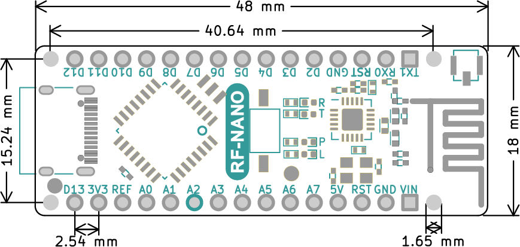

  

## Arduino和nRF24L01+The chip pin connection is as below

|  ATmega328P  | nRF24L01+ |
|  ----  | ----  |
| D7 | CE |
| D8 | CSN |
| D11  | MOSI |
| D12  | MISO |
| D13 | SCK |

**Note: The D7, D8, D11, D12, and D13 pins that have already been occupied by the RF-Nano cannot be reused.**


## CH340G Driver Installation

[CH340G Driver Download Link](https://www.wch.cn/downloads/CH341SER_ZIP.html)

## RF24 Library Installation

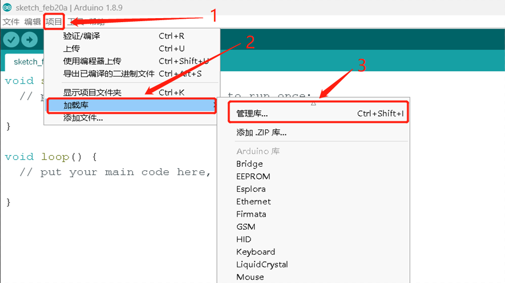

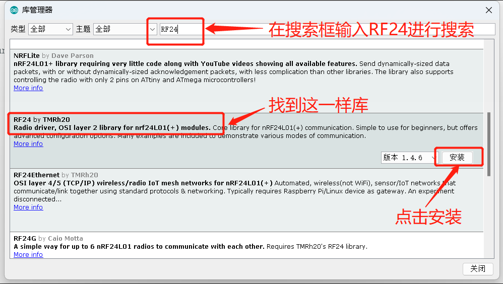

### Selection of RF-Nano main board

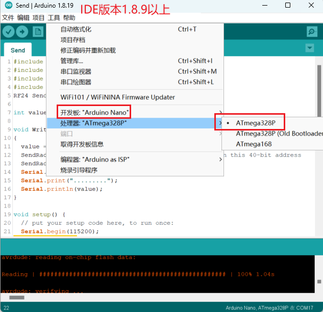


## Explanation of Key Functions

### Basic Functions

| Function Name                                                      | Description                            |
| ------------------------------------------------------------ | ------------------------------- |
| **[RF24](http://maniacbug.github.io/RF24/classRF24.html#a8cd165a822c8f77e10782c6729c5b088)** (uint8_t _cepin, uint8_t _cspin) | The default values for CE pin and CSN pin are 9 and 10 |
| void **[begin](http://maniacbug.github.io/RF24/classRF24.html#a9e720d303ad594de611a813c69244517)** (void) | Start wireless send-receive                   |
| void **[startListening](http://maniacbug.github.io/RF24/classRF24.html#a30a2733a3889bdc331fe2d2f4f0f7b39)** (void) | Begin listening on the specified channel              |
| void **[stopListening](http://maniacbug.github.io/RF24/classRF24.html#a6f144d73fc447c8ac2d1a4166210fd88)** (void) | Stop listening.                        |
| bool **[ write](http://maniacbug.github.io/RF24/classRF24.html#a4cd4c198a47704db20b6b5cf0731cd58)** (const void *buf, uint8_t len) | Send data to the specified channel              |
| bool **[available](http://maniacbug.github.io/RF24/classRF24.html#a127105eb7a3b351cfe777c1cec50627a)** (void) | Check if data has been received            |
| bool **[read](http://maniacbug.github.io/RF24/classRF24.html#a391eb0016877ec7486936795aed3b5ee)** (void *buf, uint8_t len) | Read data into a buffer                  |
| void **[openWritingPipe](http://maniacbug.github.io/RF24/classRF24.html#a50c8e68ee840e1860a31dbdc83afbd77)** (uint64_t address) | Open a sending channel to the address         |
| void **[openReadingPipe](http://maniacbug.github.io/RF24/classRF24.html#aa7e8523f86f9f8f20c274e0c89a5fd45)** (uint8_t number, uint64_t address) | Open a data receiving channel                |

### Configuration function

| Function Name                                                      | Description                                                         |
| ------------------------------------------------------------ | ------------------------------------------------------------ |
| void **[setRetries](http://maniacbug.github.io/RF24/classRF24.html#a4c6d3959c8320e64568395f4ef507aef)** (uint8_t delay, uint8_t count) | Set the retry time and the retry count                                     |
| void **[setChannel](http://maniacbug.github.io/RF24/classRF24.html#a5e6e5a5f6c85d2638381cab2c0f3702e)** (uint8_t channel) | Set the communication channel range to 0~125. Setting it to 115 can avoid WiFi channels               |
| void **[setPayloadSize](http://maniacbug.github.io/RF24/classRF24.html#a343e5d23477181011dea030fafb1954f)** (uint8_t size) | Set the static payload length for sending and receiving data                                     |
| uint8_t **[getPayloadSize](http://maniacbug.github.io/RF24/classRF24.html#a0aa0c7cbe3d38fef4722f3f1d2d6c5f1)** (void) | Get the static payload length for sending and receiving data                                     |
| uint8_t **[getDynamicPayloadSize](http://maniacbug.github.io/RF24/classRF24.html#a65963ed8d8fd45f847e2f673995b85e1)** (void) | Set the dynamic payload length for sending and receiving data                                     |
| void **[enableAckPayload](http://maniacbug.github.io/RF24/classRF24.html#abf8efced2ee9edbcc6510878b20edc1b)** (void) | Enable automatic acknowledgement of data packets                                           |
| void **[enableDynamicPayloads](http://maniacbug.github.io/RF24/classRF24.html#a443888504975d7441d6452a09d09a8fa)** (void) | Enable dynamic payload                                               |
| bool **[isPVariant](http://maniacbug.github.io/RF24/classRF24.html#a62846750b82682beb7593719eb60ed60)** (void) | Determine whether the hardware is an nRF24L01+ or not.       |
| void **[setAutoAck](http://maniacbug.github.io/RF24/classRF24.html#aec71746d59da978bcbb975167886a2cc)** (bool enable) | Enable automatic acknowledgement packet                                               |
| void **[setAutoAck](http://maniacbug.github.io/RF24/classRF24.html#a60dba9e558f3620ab489af68ea3dea9c)** (uint8_t pipe, bool enable) | Enable or disable auto-acknowlede packets on a per pipeline basis |
| void **[setPALevel](http://maniacbug.github.io/RF24/classRF24.html#ae14164610ab5af94cf44b2743daa8dc9)** (**[rf24_pa_dbm_e](http://maniacbug.github.io/RF24/RF24_8h.html#a1e4cd0bea93e6b43422855fb0120aace)** level) | Set the transmission power level 0,1,2,3db                                   |
| **[rf24_pa_dbm_e](http://maniacbug.github.io/RF24/RF24_8h.html#a1e4cd0bea93e6b43422855fb0120aace)** **[getPALevel](http://maniacbug.github.io/RF24/classRF24.html#ac53facef9c62aa82589cf9cc48913267)** (void) | Get the transmission power                                                 |
| bool **[ setDataRate](http://maniacbug.github.io/RF24/classRF24.html#aeb9920e7a95699748b003c4a839b0814)** (**[rf24_datarate_e](http://maniacbug.github.io/RF24/RF24_8h.html#a82745de4aa1251b7561564b3ed1d6522)** speed) | Set the data transmission rate                                            |
| void **[setCRCLength](http://maniacbug.github.io/RF24/classRF24.html#a89f626fc4a58dd997153bcc0f8198b9e)** (**[rf24_crclength_e](http://maniacbug.github.io/RF24/RF24_8h.html#adbe00719f3f835c82bd007081d040a7e)** length) | Set the length of CRC check                                              |
| **[rf24_crclength_e](http://maniacbug.github.io/RF24/RF24_8h.html#adbe00719f3f835c82bd007081d040a7e)** **[getCRCLength](http://maniacbug.github.io/RF24/classRF24.html#aba4ca91b829afcd94a4c11e0343e3796)** (void) | Get the length of CRC check                                              |
| void **[disableCRC](http://maniacbug.github.io/RF24/classRF24.html#a5eacd9ecfbc19864801d714c292cf8be)** (void) | Disable CRC check.                                                  |

### Advanced operations

| Function Name                                                       | Description                                                         |
| ------------------------------------------------------------ | ------------------------------------------------------------ |
| void **[printDetails](http://maniacbug.github.io/RF24/classRF24.html#adc95213ed4c8569a90eb33122e16cea6)** (void) | Print all parameter configurations                                             |
| void **[powerDown](http://maniacbug.github.io/RF24/classRF24.html#aa0a51923a09ba4f3478aba9be0f8a6a1) **(void) | Enter power-down low-power mode                                           |
| void **[[powerUp](http://maniacbug.github.io/RF24/classRF24.html#a5cdaf47aa0edd6dca1b9a8bb7972a1a3)**(void) | Exit low-power mode                                               |
| uint8_t **[getPayloadSize](http://maniacbug.github.io/RF24/classRF24.html#a0aa0c7cbe3d38fef4722f3f1d2d6c5f1)** (void) | Get the static payload length for transmission and reception                                     |
| uint8_t **[getDynamicPayloadSize](http://maniacbug.github.io/RF24/classRF24.html#a65963ed8d8fd45f847e2f673995b85e1)** (void) | Set the dynamic payload length for transmission and reception                                     |
| void **[enableAckPayload](http://maniacbug.github.io/RF24/classRF24.html#abf8efced2ee9edbcc6510878b20edc1b)** (void) | Enable automatic acknowledgement of data packets                                           |
| void **[enableDynamicPayloads](http://maniacbug.github.io/RF24/classRF24.html#a443888504975d7441d6452a09d09a8fa)** (void) | Enable dynamic payload packets                                               |
| bool **[isPVariant](http://maniacbug.github.io/RF24/classRF24.html#a62846750b82682beb7593719eb60ed60)** (void) | Determine whether the hardware is an nRF24L01+ or not.       |
| void **[setAutoAck](http://maniacbug.github.io/RF24/classRF24.html#aec71746d59da978bcbb975167886a2cc)** (bool enable) | Enable automatic acknowledgement packets                                               |
| void **[setAutoAck](http://maniacbug.github.io/RF24/classRF24.html#a60dba9e558f3620ab489af68ea3dea9c)** (uint8_t pipe, bool enable) | Enable or disable auto-acknowlede packets on a per pipeline basis |
| void **[setPALevel](http://maniacbug.github.io/RF24/classRF24.html#ae14164610ab5af94cf44b2743daa8dc9)** (**[rf24_pa_dbm_e](http://maniacbug.github.io/RF24/RF24_8h.html#a1e4cd0bea93e6b43422855fb0120aace)** level) | Set the transmission power level 0,1,2,3db                                   |
| **[rf24_pa_dbm_e](http://maniacbug.github.io/RF24/RF24_8h.html#a1e4cd0bea93e6b43422855fb0120aace)** **[getPALevel](http://maniacbug.github.io/RF24/classRF24.html#ac53facef9c62aa82589cf9cc48913267)** (void) | Get the transmission power                                                 |
| bool **[ setDataRate](http://maniacbug.github.io/RF24/classRF24.html#aeb9920e7a95699748b003c4a839b0814)** (**[rf24_datarate_e](http://maniacbug.github.io/RF24/RF24_8h.html#a82745de4aa1251b7561564b3ed1d6522)** speed) | Set the data transmission rate                                             |
| void **[setCRCLength](http://maniacbug.github.io/RF24/classRF24.html#a89f626fc4a58dd997153bcc0f8198b9e)** (**[rf24_crclength_e](http://maniacbug.github.io/RF24/RF24_8h.html#adbe00719f3f835c82bd007081d040a7e)** length) | Set the length of CRC check                                              |
| **[rf24_crclength_e](http://maniacbug.github.io/RF24/RF24_8h.html#adbe00719f3f835c82bd007081d040a7e)** **[getCRCLength](http://maniacbug.github.io/RF24/classRF24.html#aba4ca91b829afcd94a4c11e0343e3796)** (void) | Get the length of CRC check                                              |
| void **[disableCRC](http://maniacbug.github.io/RF24/classRF24.html#a5eacd9ecfbc19864801d714c292cf8be)** (void) | Disable CRC check                                                  |


### nRF24L01/Si24R1 chip wireless communication notes

**Communication channel**

2.4G wireless communication begins at 2400MHz and takes every 1MHz increment as a frequency point, up to a maximum of 2525MHz (when setting the frequency, make sure to avoid WiFi interference). There are a total of 126 frequency values, which are called RF Channels by nrf2401. Similar to the issue of baud rate, do not modify them when sending or receiving data. Based on the FSK principle, for two modules to communicate normally, they must use the same carrier frequency, which means that the values of RF Channels on both sides must be the same.

The frequency interval of RF Channels is 1MHz. If the bandwidth exceeds 1MHz, adjacent RF Channels will overlap on the frequency band and interfere with each other, resulting in those channels being occupied.

When the baud rate of nRF2401 is 250Kbps or 1Mbps, the bandwidth can be less than 1MHz, which ensures that the 126 RF Channels do not interfere with each other. This means we have a total of 126 channels to use, which is perfect. However, when the baud rate is 2Mbps, the bandwidth cannot be less than 1MHz, so we can only make the bandwidth less than 2MHz, which means that we can only use half of the channels

**Address length** 

The address length of nRF24L01 is 3-5 bytes, and we can choose one among the 3/4/5-byte options

When nRF2401 is used as a PRX receiver, there can be up to six receiving addresses inside, and one or more receiving addresses can be enabled or disabled by configuration [enable separately] and [disable separately]. If multiple addresses are enabled, when PRX receives the data signal, the target address in the data will be compared with these addresses in turn. As long as one address matches, PRX regards the data as addressed to itself. The address that matches will be attached to the response data when PRX sends a reply

The six receiving addresses in nRF2401 are called data pipes, which everyone will undoubtedly come into contact with when using the library. The pipes are numbered from pipe0 to pipe5

The pipe address length can be set to 3/4/5 bytes, but these six pipes can only share one address length configuration and cannot use different address lengths separately.
For pipe0, the address can be up to 5 bytes long, and the address value can be set arbitrarily. When 3/4-byte address length is used, only the lowest 3/4-byte of the 5-byte address is used, and the highest byte is ignored. For pipe1, it is the same as pipe0. For pipe2~pipe5, the address can be up to 5 bytes long, but only the lowest byte of the address value can be set arbitrarily, and the remaining high bytes can only be shared/follow the value configured in pipe1.

**Reception section**

The nrf2401 only has one RF module and can only receive one set of data at any given time.
If you are using the 【multi-PTX <-> single-PRX with multiple pipes】scheme in Many-to-one communication,you need to be aware of overlapping transmission times.
If two PTXs transmit data to the same PRX at the same time, even if their addresses are different, the two signals will interfere with each other and the PRX will not be able to decode either of their signals.

**Transmitter section**


Now let's talk about the PTX side. As mentioned earlier, when the PTX receives response data, it also needs to check the address，The PTX uses the data channel pipe0 to receive data, which is fixed and cannot be changed，Therefore, we must【enable】the pipe0 channel and【configure its address and address width】，Once again, it is important to emphasize that this address is not strictly the address of the PTX, but the address of the target PRX! In fact, the PTX does not have its own address.

Don't forget that when the PTX starts to send data, it also needs an address. According to common sense, since the address for pipe0 is configured, the PTX should know where to send the data when it transmits. However, it's not that simple: before sending data, the nRF2401 must be given a separate transmission address (TX_ADDR). In other words, in order for the PTX to correctly send and receive data, the target address must be configured twice for the PTX (i.e. write the address to two different places). One is for pipe0 and the other is for TX_ADDR, and the values at these two places must be the same.

## Module self-check program

```c
#include <SPI.h>
#include <Wire.h>
#include <RF24.h>
#include <printf.h>

RF24 Radio(7,8);
void setup() {
  // put your setup code here, to run once:
  Serial.begin(115200);
  printf_begin();
  Serial.println();
  Serial.println(F("RF_NANO v3.0 Test"));
  //
  // Setup and configure rf radio
  //
  Radio.begin();
  Radio.setAddressWidth(5);
  Radio.openReadingPipe(0, 0x1212121212LL);
  Radio.openReadingPipe(1, 0x3434343431LL);
  Radio.openReadingPipe(2, 0x3434343432LL);
  Radio.openReadingPipe(3, 0x3434343433LL);
  Radio.openReadingPipe(4, 0x3434343434LL);
  Radio.openReadingPipe(5, 0x3434343435LL);
  Radio.setChannel(115);            //115 band above WIFI signals
  Radio.setPALevel(RF24_PA_MAX);    //MIN power low rage
  Radio.setDataRate(RF24_1MBPS) ;   //Minimum speed
  Serial.println("Setup Initialized");
  Radio.printDetails();
}
```


## Point-to-point transmission test

**Send**

```c
#include <SPI.h>
#include <Wire.h>
#include <RF24.h>
#include <printf.h>
RF24 SendRadio(7,8);

int value;

void WriteData()
{
  value = random(255); //随机一个0-255的值，并赋给value
  SendRadio.openWritingPipe(0xF0F0F0F066);//Sends data on this 40-bit address
  SendRadio.write(&value, sizeof(value));//发送value的值
  Serial.print("WriteData");
  Serial.print(".........");
  Serial.println(value);
}

void setup() {
  // put your setup code here, to run once:
  Serial.begin(115200);
  printf_begin();
  Serial.println(F("RF-NANO v4.0 Send Test"));

  //
  // Setup and configure rf radio
  //
  // Get into standby mode

  SendRadio.begin();
  SendRadio.setAddressWidth(5);
  SendRadio.openWritingPipe(0xF0F0F0F066LL);
  SendRadio.setChannel(115);           //115 band above WIFI signals
  SendRadio.setPALevel(RF24_PA_MAX);   //MIN power low rage
  SendRadio.setDataRate(RF24_1MBPS) ;  //Minimum speed
  SendRadio.stopListening(); //Stop Receiving and start transminitng
  Serial.print("Send Setup Initialized");
  SendRadio.printDetails();
  delay(500);
}

void loop() {
  WriteData();
  delay(1000);
}
```

**Receive**

```c
#include <SPI.h>
#include<Wire.h>
#include <RF24.h>
#include <printf.h>

RF24 ReceiveRadio (7, 8);

byte value[32];

void ReadData()
{
  uint8_t bytes;
  if (ReceiveRadio.available())
  {
    while (ReceiveRadio.available())
    { 
      bytes = ReceiveRadio.getPayloadSize();
      ReceiveRadio.read(value, bytes);//接收数据，并将数据赋值给value
    }
    Serial.print("ReadData");
    Serial.print(".........");
    Serial.println(value[0]);//打印所接收的值
  }
}

void setup() {
  // put your setup code here, to run once:
  Serial.begin(115200);
  printf_begin();
  Serial.println(F("RF-NANO v4.0 Receive Test"));

  //
  // Setup and configure rf radio
  //
  ReceiveRadio.begin();
  ReceiveRadio.setAddressWidth(5);
  ReceiveRadio.openReadingPipe(1, 0xF0F0F0F066LL);
  ReceiveRadio.setChannel(115);  //115 band above WIFI signals
  ReceiveRadio.setPALevel(RF24_PA_MAX); //MIN power low rage
  ReceiveRadio.setDataRate(RF24_1MBPS) ;  //Minimum speed
  ReceiveRadio.startListening();
  Serial.println("Receive Setup Initialized");
  ReceiveRadio.printDetails();
  delay(500);
}

void loop() {
  ReadData();
}
```


## one-to-many test

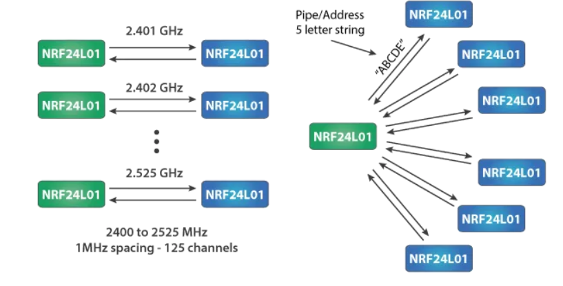

Method 1: Same channel, different address


Method 2: Same address, different channel

### Support for visual programming software.

In development......

## Contact us

**Technology + cooperation**  wechat: jundi0808(ken@emakefun.com)

