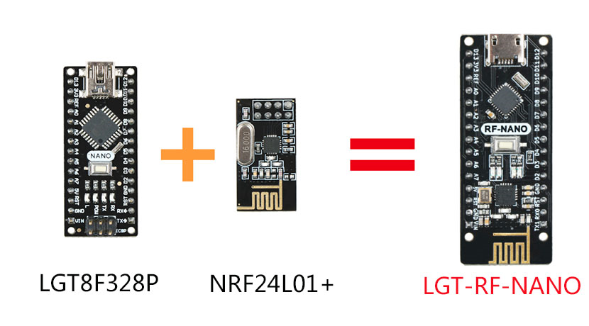
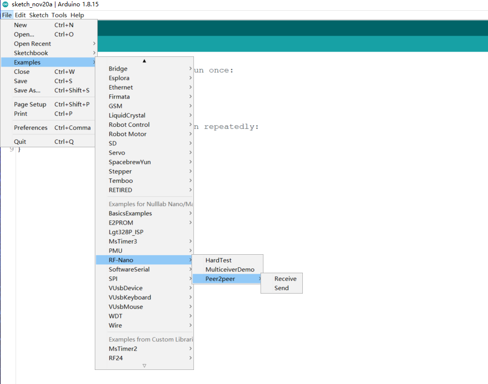

# lgt-rf-nano[中文版](./README_ZH.md)

LGT-RF-Nano is a 2.4G communication product based on the combination of domestic LGT8F328P chip and NRF24L01+ chip.

### What is the LGT8F328P ?

The LGT8F328P is a chip compatible with AVR instruction set and Atmega328P. After loading the Arduino software support package, you can use the Arduino IDE to program. The usage method and 99.9% of the application scenarios can replace the Atmega328P chip.

**LGT8F328P Parameter:**

1. The LGT8F328P enhances 8-bit RISC core, supports 16-bit digital operation expansion, and can run at a core frequency of up to 32MHz within the working range of 1.8V-5.5V;

2. The LGT8F328P internal 32K bytes of FLASH program memory, 2K bytes of data SRAM, built-in control logic that simulates FLASH as EEPROM, part of the program FLASH can be divided into data FLASH space according to application needs, and EEPROM-like interface access is realized through the EEPROM controller ；

3. The LGT8F328P integrates a wealth of analog peripherals, including 12-bit ADC, programmable gain differential amplifier, high-precision 1.024/2.048/4.096V internal reference voltage, 8-bit DAC and high-speed analog comparator; at the same time LGT8F328P also integrates commonly used digital Interface controller, supports multi-channel complementary PWM output and dead zone control；

4. The LGT8F328P architecture design is relatively new, and its peripheral functions are far stronger than that of the Atmega328P. In particular, the program encryption capability far exceeds Atmega328P.

   

### Why use LGT8F328P instead of Atmega328P?

As we all know, the shortage of chips will also have a great impact on the maker industry. The price of Atmega328P chips has already doubled and the supply is unstable. The market is full of refurbished, copycats, and even typing (printed on the same package) chips, which seriously interferes with the normal production and use of Maker's products. I came into contact with the LGT8F328P chip by chance. At first, I thought it was a fake chip. After rigorous testing and direct communication with the chip manufacturer, I found that it was an AVR instruction set chip, not a fake chip. Similar to GD to STM32. It is a brand-new chip, but it is compatible to replace Atmega328P. After testing and optimization by the Nulllab technical team for more than half a year, our arduino IDE software support package is 99.9% compatible with Atmega328P. In this way, makers can buy cost-effective and reliable arduino products. The Nulllab technical team provides long-term technical support and chip supply for this, so makers can use it with confidence.

**What is the LGT-RF-Nano ?**

It is a module based on the LGT8F328P main control chip combined with the 2.4G wireless chip nRF24L01+, and the name is LGT-RF-Nano.

**Pin connection parameters**

|  LGT8F328P  | NRF24L01+  |
|  ----  | ----  |
| D9  | CE |
| D10  | CSN |
| D11  | MOSI |
| D12  | MISO |
| D13 | SCK |
|D9, D10, D11, D12, D13 pins occupied by rf-nano itself cannot be reused||

## Arduino IDE software package

The LGT8F328P uses Arduino IDE to program and requires independent software support package support

[**Install the Arduino IDE software packageClick**](https://github.com/nulllaborg/arduino_nulllab)

## Library instructions
The library of this module is modified based on the latest version of [RF24](https://github.com/maniacbug/RF24). The LGT arduino IDE software package has integrated this library as shown below, we can open it directly in the sample program.



**Key function description**

Basic function

| Function name                                                | Instructioin                                                 |
| ------------------------------------------------------------ | ------------------------------------------------------------ |
| **[RF24](http://maniacbug.github.io/RF24/classRF24.html#a8cd165a822c8f77e10782c6729c5b088)** (uint8_t _cepin, uint8_t _cspin) | ce pin default is 9                                                           cs pin default is 10 |
| void **[begin](http://maniacbug.github.io/RF24/classRF24.html#a9e720d303ad594de611a813c69244517)** (void) | Start wireless transceiver                                   |
| void **[startListening](http://maniacbug.github.io/RF24/classRF24.html#a30a2733a3889bdc331fe2d2f4f0f7b39)** (void) | Start monitoring the specified channel                       |
| void **[stopListening](http://maniacbug.github.io/RF24/classRF24.html#a6f144d73fc447c8ac2d1a4166210fd88)** (void) | stop monitor                                                 |
| bool **[ write](http://maniacbug.github.io/RF24/classRF24.html#a4cd4c198a47704db20b6b5cf0731cd58)** (const void *buf, uint8_t len) | Send data to the specified channel                           |
| bool **[available](http://maniacbug.github.io/RF24/classRF24.html#a127105eb7a3b351cfe777c1cec50627a)** (void) | Check if there is data received                              |
| bool **[read](http://maniacbug.github.io/RF24/classRF24.html#a391eb0016877ec7486936795aed3b5ee)** (void *buf, uint8_t len) | Read data to cache                                           |
| void **[openWritingPipe](http://maniacbug.github.io/RF24/classRF24.html#a50c8e68ee840e1860a31dbdc83afbd77)** (uint64_t address) | Open the address sending channel                             |
| void **[openReadingPipe](http://maniacbug.github.io/RF24/classRF24.html#aa7e8523f86f9f8f20c274e0c89a5fd45)** (uint8_t number, uint64_t address) | Open the data receiving channel                              |

Configuration function

| Function name                                                | Instructioin                                                 |
| ------------------------------------------------------------ | ------------------------------------------------------------ |
| void **[setRetries](http://maniacbug.github.io/RF24/classRF24.html#a4c6d3959c8320e64568395f4ef507aef)** (uint8_t delay, uint8_t count) | Set the retry time and number of retries                     |
| void **[setChannel](http://maniacbug.github.io/RF24/classRF24.html#a5e6e5a5f6c85d2638381cab2c0f3702e)** (uint8_t channel) | Set the communication channel range 0—125,                   set 115 to avoid the wifi channel |
| void **[setPayloadSize](http://maniacbug.github.io/RF24/classRF24.html#a343e5d23477181011dea030fafb1954f)** (uint8_t size) | Set the load length of static sending and receiving data     |
| uint8_t **[getPayloadSize](http://maniacbug.github.io/RF24/classRF24.html#a0aa0c7cbe3d38fef4722f3f1d2d6c5f1)** (void) | Obtain the static data load length sent and received         |
| uint8_t **[getDynamicPayloadSize](http://maniacbug.github.io/RF24/classRF24.html#a65963ed8d8fd45f847e2f673995b85e1)** (void) | Set the load length of dynamic data sent and received        |
| void **[enableAckPayload](http://maniacbug.github.io/RF24/classRF24.html#abf8efced2ee9edbcc6510878b20edc1b)** (void) | Enable automatic response packet                             |
| void **[enableDynamicPayloads](http://maniacbug.github.io/RF24/classRF24.html#a443888504975d7441d6452a09d09a8fa)** (void) | Enable dynamic load package                                  |
| bool **[isPVariant](http://maniacbug.github.io/RF24/classRF24.html#a62846750b82682beb7593719eb60ed60)** (void) | Determine whether the hardware is an nRF24L01+ or not.       |
| void **[setAutoAck](http://maniacbug.github.io/RF24/classRF24.html#aec71746d59da978bcbb975167886a2cc)** (bool enable) | Enable auto answer package                                   |
| void **[setAutoAck](http://maniacbug.github.io/RF24/classRF24.html#a60dba9e558f3620ab489af68ea3dea9c)** (uint8_t pipe, bool enable) | Enable or disable auto-acknowlede packets on a per pipeline basis |
| void **[setPALevel](http://maniacbug.github.io/RF24/classRF24.html#ae14164610ab5af94cf44b2743daa8dc9)** (**[rf24_pa_dbm_e](http://maniacbug.github.io/RF24/RF24_8h.html#a1e4cd0bea93e6b43422855fb0120aace)** level) | Set transmit power level 0,1,2,3db                           |
| **[rf24_pa_dbm_e](http://maniacbug.github.io/RF24/RF24_8h.html#a1e4cd0bea93e6b43422855fb0120aace)** **[getPALevel](http://maniacbug.github.io/RF24/classRF24.html#ac53facef9c62aa82589cf9cc48913267)** (void) | Get transmit power                                           |
| bool **[ setDataRate](http://maniacbug.github.io/RF24/classRF24.html#aeb9920e7a95699748b003c4a839b0814)** (**[rf24_datarate_e](http://maniacbug.github.io/RF24/RF24_8h.html#a82745de4aa1251b7561564b3ed1d6522)** speed) | Set data transfer speed rate                                 |
| void **[setCRCLength](http://maniacbug.github.io/RF24/classRF24.html#a89f626fc4a58dd997153bcc0f8198b9e)** (**[rf24_crclength_e](http://maniacbug.github.io/RF24/RF24_8h.html#adbe00719f3f835c82bd007081d040a7e)** length) | Set CRC check length                                         |
| **[rf24_crclength_e](http://maniacbug.github.io/RF24/RF24_8h.html#adbe00719f3f835c82bd007081d040a7e)** **[getCRCLength](http://maniacbug.github.io/RF24/classRF24.html#aba4ca91b829afcd94a4c11e0343e3796)** (void) | Get CRC check length                                         |
| void **[disableCRC](http://maniacbug.github.io/RF24/classRF24.html#a5eacd9ecfbc19864801d714c292cf8be)** (void) | Cancel CRC check                                             |

Advanced operation

| Function name                                                | Instruction                                                  |
| ------------------------------------------------------------ | ------------------------------------------------------------ |
| void **[printDetails](http://maniacbug.github.io/RF24/classRF24.html#adc95213ed4c8569a90eb33122e16cea6)** (void) | Print all parameter configuration                            |
| void **[powerDown](http://maniacbug.github.io/RF24/classRF24.html#aa0a51923a09ba4f3478aba9be0f8a6a1) **(void) | Enter power-down low-power mode                              |
| void **[[powerUp](http://maniacbug.github.io/RF24/classRF24.html#a5cdaf47aa0edd6dca1b9a8bb7972a1a3)**(void) | Introduce low-power mode                                     |
| uint8_t **[getPayloadSize](http://maniacbug.github.io/RF24/classRF24.html#a0aa0c7cbe3d38fef4722f3f1d2d6c5f1)** (void) | Obtain the static data load length sent and received         |
| uint8_t **[getDynamicPayloadSize](http://maniacbug.github.io/RF24/classRF24.html#a65963ed8d8fd45f847e2f673995b85e1)** (void) | Set the load length of dynamic data sent and received        |
| void **[enableAckPayload](http://maniacbug.github.io/RF24/classRF24.html#abf8efced2ee9edbcc6510878b20edc1b)** (void) | Enable automatic response packet                             |
| void **[enableDynamicPayloads](http://maniacbug.github.io/RF24/classRF24.html#a443888504975d7441d6452a09d09a8fa)** (void) | Enable dynamic load package                                  |
| bool **[isPVariant](http://maniacbug.github.io/RF24/classRF24.html#a62846750b82682beb7593719eb60ed60)** (void) | Determine whether the hardware is an nRF24L01+ or not.       |
| void **[setAutoAck](http://maniacbug.github.io/RF24/classRF24.html#aec71746d59da978bcbb975167886a2cc)** (bool enable) | Enable automatic response packet                             |
| void **[setAutoAck](http://maniacbug.github.io/RF24/classRF24.html#a60dba9e558f3620ab489af68ea3dea9c)** (uint8_t pipe, bool enable) | Enable or disable auto-acknowlede packets on a per pipeline basis |
| void **[setPALevel](http://maniacbug.github.io/RF24/classRF24.html#ae14164610ab5af94cf44b2743daa8dc9)** (**[rf24_pa_dbm_e](http://maniacbug.github.io/RF24/RF24_8h.html#a1e4cd0bea93e6b43422855fb0120aace)** level) | Set transmit power level 0,1,2,3db                           |
| **[rf24_pa_dbm_e](http://maniacbug.github.io/RF24/RF24_8h.html#a1e4cd0bea93e6b43422855fb0120aace)** **[getPALevel](http://maniacbug.github.io/RF24/classRF24.html#ac53facef9c62aa82589cf9cc48913267)** (void) | Get transmit power                                           |
| bool **[ setDataRate](http://maniacbug.github.io/RF24/classRF24.html#aeb9920e7a95699748b003c4a839b0814)** (**[rf24_datarate_e](http://maniacbug.github.io/RF24/RF24_8h.html#a82745de4aa1251b7561564b3ed1d6522)** speed) | Set data transfer speed rate                                 |
| void **[setCRCLength](http://maniacbug.github.io/RF24/classRF24.html#a89f626fc4a58dd997153bcc0f8198b9e)** (**[rf24_crclength_e](http://maniacbug.github.io/RF24/RF24_8h.html#adbe00719f3f835c82bd007081d040a7e)** length) | Set CRC check length                                         |
| **[rf24_crclength_e](http://maniacbug.github.io/RF24/RF24_8h.html#adbe00719f3f835c82bd007081d040a7e)** **[getCRCLength](http://maniacbug.github.io/RF24/classRF24.html#aba4ca91b829afcd94a4c11e0343e3796)** (void) | Get CRC check length                                         |
| void **[disableCRC](http://maniacbug.github.io/RF24/classRF24.html#a5eacd9ecfbc19864801d714c292cf8be)** (void) | Cancel CRC check                                             |


### nRF24L01+ chip wireless communication introduce

**Communication Channel**

2.4G wireless communication uses 2400MHz as the starting value, and takes a frequency point every 1MHz, up to 2525MHz (remember to avoid WiFi interference when setting the frequency), a total of 126 values, nrf24l01 calls these values RF Channel. For the same problem as the baud rate, do not modify it when sending and receiving data. According to the principle of FSK, the two modules receive and send each other. To communicate normally, both parties must use the same carrier frequency, that is, the values of the RF Channels on both sides must be the same.

The frequency interval of the RF Channel is 1MHz. If the frequency bandwidth exceeds 1MHz, the two adjacent RF Channels will overlap in the frequency band and interfere with each other, and the two channels will be occupied.

When the baud rate of nrf2401 is 250Kbps or 1Mbps, the bandwidth can be less than 1MHz, so that 126 RF Channels will not affect each other, that is to say, we have 126 channels available, which is perfect. But when the baud rate is 2Mbps, and the bandwidth is less than 1MHz, we can only make the bandwidth less than 2MHz, which means that we only have half of the channels available.

**Address length** 

The address length of nrf24L01 is 3~5 bytes, 3/4/5 bytes choose 1 from 3

When nrf2401 is used as a PRX receiver, there can be at most 6 receiving addresses inside at the same time, and one or more receiving addresses can be configured through [Enable separately] or [Disable separately]. If multiple addresses are enabled, when PRX receives a data signal, the target address in the data will be compared with these addresses in turn at the same time. As long as one address matches, PRX considers the data to be for itself. Which address is matched, PRX will attach this address to the response data when replying.

nrf2401 refers to these 6 receiving address related things as data pipes, which are pipes that everyone must contact when using the library. The numbers are pipe0~pipe5.

The pipe address length can be arbitrarily configured to 3/4/5 bytes, but these 6 pipes can only share one length configuration, and different address lengths cannot be used separately;

The pipe0 address can be up to 5 bytes, and the address value can be configured at will. When the address length of 3/4 bytes is taken, the lowest 3/4 byte of the 5 bytes is used, and the upper byte is ignored；
pipe1 has the same characteristics as pipe0;
The pipe2~pipe5 address can be up to 5 bytes, but only the lowest byte of the address value can be configured at will, and the remaining high byte can only share/follow the value configured in pipe1

**Receiving part**

nrf2401 has only one radio frequency module, and can only receive one copy of data at any time.
If you use [Multiple PTX<-->Single PRX Multipipe] scheme in many-to-one communication, you need to pay attention to staggering the respective sending time.
If two PTXs send data to one PRX at the same time, even if the addresses are different, the two signals will interfere with each other, and the signal of the PRX cannot be solved.

**Launch part**

Let’s talk about the PTX side. As mentioned earlier, PTX also needs to detect the address when receiving the response data. PTX uses the data channel pipe0 to receive data (cannot be changed), so we must [enable] the pipe0 channel and configure the address and Address width], again, this address is not strictly speaking the address of the PTX, but the address of the target PRX! In fact, PTX does not have its own address.

Don’t forget that PTX also needs an address when it first sends data. According to common sense, the address of pipe0 is configured. When PTX sends data, it should know which address to send to, but this is not the case: nrf2401 before sending data It must be separately configured with a sending address (TX_ADDR), that is, if you want PTX to send and receive data correctly, you must configure the target address to the PTX configuration twice (that is, write an address to two different places) ), once for pipe0 and once for TX_ADDR, the values in these two places must be the same.

## Module self-check program

```c
#include <SPI.h>
#include <Wire.h>
#include "RF24.h"
#include "printf.h"
RF24 Radio(9, 10);
void setup() {
  // put your setup code here, to run once:
  Serial.begin(115200);
  
  printf_begin();
  Serial.println();
  Serial.println(F("LGT RF_NANO v2.0 Test"));
  //
  // Setup and configure rf radio
  //
  Radio.begin();
  Radio.setAddressWidth(5);
  Radio.openReadingPipe(0, 0x1212121212LL);
  Radio.openReadingPipe(1, 0x3434343431LL);
  Radio.openReadingPipe(2, 0x3434343432LL);
  Radio.openReadingPipe(3, 0x3434343433LL);
  Radio.openReadingPipe(4, 0x3434343434LL);
  Radio.openReadingPipe(5, 0x3434343435LL);
  Radio.setChannel(115);            //115 band above WIFI signals
  Radio.setPALevel(RF24_PA_MAX);    //MIN power low rage
  Radio.setDataRate(RF24_1MBPS) ;   //Minimum speed
  Serial.println("Setup Initialized");
  Radio.printDetails();
}
```


## Point-to-point receiving and sending test

**send**

```c
#include <SPI.h>
#include <Wire.h>
#include "RF24.h"
#include "printf.h"
RF24 SendRadio(9, 10);

int value;

void WriteData()
{
  value = random(255);
  SendRadio.openWritingPipe(0xF0F0F0F066);//Sends data on this 40-bit address
  SendRadio.write(&value, sizeof(value));
  Serial.print("WriteData");
  Serial.print(".........");
  Serial.println(value);
}

void setup() {
  // put your setup code here, to run once:
  Serial.begin(115200);
  printf_begin();
  Serial.println(F("LGT RF-NANO v2.0 Send Test"));

  //
  // Setup and configure rf radio
  //
  // Get into standby mode

  SendRadio.begin();
  SendRadio.setAddressWidth(5);
  SendRadio.openWritingPipe(0xF0F0F0F066LL);
  SendRadio.setChannel(115);           //115 band above WIFI signals
  SendRadio.setPALevel(RF24_PA_MAX);   //MIN power low rage
  SendRadio.setDataRate(RF24_1MBPS) ;  //Minimum speed
  SendRadio.stopListening(); //Stop Receiving and start transminitng
  Serial.print("Send Setup Initialized");
  SendRadio.printDetails();
  delay(500);
}

void loop() {
  WriteData();
  delay(1000);
}
```

**Receive**

```c
#include <SPI.h>
#include<Wire.h>
#include "RF24.h"
#include "printf.h"
RF24 ReceiveRadio (9, 10);

byte value[32];

void ReadData()
{
  uint8_t bytes;
  if (ReceiveRadio.available())
  {
    while (ReceiveRadio.available())
    { 
      bytes = ReceiveRadio.getPayloadSize();
      ReceiveRadio.read(value, bytes);
    }
    Serial.print("ReadData");
    Serial.print(".........");
    Serial.println(value[0]);
  }
}

void setup() {
  // put your setup code here, to run once:
  Serial.begin(115200);
  printf_begin();
  Serial.println(F("LGT RF-NANO v2.0 Receive Test"));

  //
  // Setup and configure rf radio
  //
  ReceiveRadio.begin();
  ReceiveRadio.setAddressWidth(5);
  ReceiveRadio.openReadingPipe(1, 0xF0F0F0F066LL);
  ReceiveRadio.setChannel(115);  //115 band above WIFI signals
  ReceiveRadio.setPALevel(RF24_PA_MAX); //MIN power low rage
  ReceiveRadio.setDataRate(RF24_1MBPS) ;  //Minimum speed
  ReceiveRadio.startListening();
  Serial.println("Receive Setup Initialized");
  ReceiveRadio.printDetails();
  delay(500);
}

void loop() {
  ReadData();
}
```

## MulticeiverDemo


## Appreciation

1、Thanks to emakefun company for the previous development of [RF-Nano](https://github.com/emakefun/rf-nano) based on the Atemag328P combination nrf24L01+ two chips so that this product has a prototype reference

2、Thanks[RF24](https://github.com/maniacbug/RF24)


