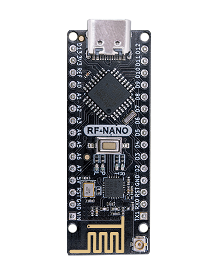
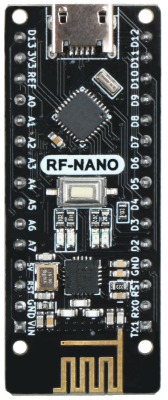
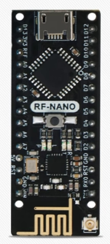

# RF-Nano

[**淘宝购买链接**](https://item.taobao.com/item.htm?spm=a1z10.5-c-s.w4002-21556097795.46.48b06b0dlTXdBo&id=691950057500 )



## 简介

  rf-nano是emakefun公司基于官方标准Arduino Nano V3.0主板集成nrf24L01+无线芯片而开发一款2.4G无线开发板 。它的尺寸，引脚完全兼容标准nanoV3.0开发板，直接兼容[RF24 开源库](https://github.com/maniacbug/RF24)，可进行功耗，传输速率，频道等设置，支持Mixly、Mblock5、Magicblock图像化编程;优化板载天线设传输距离达30m，板载IPEX贴片天线座，使用外置天线传输距离可达100m。


### 主要技术参数

- 处理器:ATmega328P-AU
- 工作电压:5V建议  VIN输入电压:6V ~ 15V
- 数字IO引脚:22个(其中6个用作PWM输出)
- 模拟输入引脚:8 (A0~A7)
- IO引脚直流电流:40mA
- 5V 引脚电流：VIN输入时1000mA
- 3.3V引脚电流 :  50mA
- Flash内存:32KB(其中0.5KB用于引导加载程序)
- SRAM: 2KB
- EEPROM: 1KB
- USB转串口芯片: CH340G芯片 外置晶振
- 工作时钟:16 MHZ

## 版本升级点

NanoV3.0，rf-nanoV1.0 2.0，RF-NANOV3.0三个产品参数对比

|  功能  | NANO   3.0 | RF-NANO (老版本V1.0 V2.0) |RF-NANO (新版本V3.0)  |
|  :--:  | :--:  |:--:  |:--:  |
| 实拍图 |  |  |  |
| 主控芯片 | ATmega328P-AU | ATmega328P-MU | ATmega328PB-AU |
| USB接口 | Mini USB | Micro USB |Type-C  |
| 尺寸 | 18mm x 45mm | 19mm x 49mm |18mm x 48mm  |
| 引脚顺序 | - | 不兼容RF24库(10，9，11，12，13) |兼容RF24库(7，8，11，12，13)  |
| 外置天线 | - | 无 |有  |

**注**：rf-nano3.0相对于rf-nano除了功能点进行了升级外，PCB设计版图也进行了全新优化，精心布局，除此以外，电源器件和外围器件也全部优化，采样知名元器件原装芯片，大大提升了整体产品的射频性能和产品稳定性。

**rf-nanoV1.0早已停产，但市面上依然有大量销售的V1.0外形的主板均为抄板山寨品，做工粗糙，器件多为翻新物料，不稳定，请注意分辨**。

## 板载天线和IPEX外置天线切换

                                                           

​      板载天线                            外置天线

**注：当图片中蓝色区域内的电容是横向焊的那就是使用的板载天线，如若是竖向焊的那就是使用的外置天线。如需切换天线，只需修改图片中蓝色区域内的电容焊接方向**

## 引脚标注图


## 原理图

[点击下载原理图](zh-cn/arduino_products/nano/RF-Nano_pic_zh/schematic/rf-nano_sch_v3.0.pdf ':ignore')

[点击下载nrf24L01+数据手册](zh-cn/arduino_products/nano/RF-Nano_pic_zh/datasheet/nrf24L01+_datasheet.pdf ':ignore')


## 机械尺寸标注


## Arduino和nRF24L01+芯片引脚连接如下

|  ATmega328P  | nRF24L01+ |
|  ----  | ----  |
| D7 | CE |
| D8 | CSN |
| D11  | MOSI |
| D12  | MISO |
| D13 | SCK |

**注 ：rf-nano已经被占用的D7，D8，D11，D12，D13引脚不能再被复用**

## CH340G驱动安装

[CH340G驱动下载链接](https://www.wch.cn/downloads/CH341SER_ZIP.html)

## RF24库安装


### RF-Nano主板选择


## 关键函数说明

### 基础函数

| 函数名                                                       | 说明                            |
| ------------------------------------------------------------ | ------------------------------- |
| **[RF24](http://maniacbug.github.io/RF24/classRF24.html#a8cd165a822c8f77e10782c6729c5b088)** (uint8_t_cepin, uint8_t_cspin) | ce引脚 默认是9   cs引脚默认是10 |
| void **[begin](http://maniacbug.github.io/RF24/classRF24.html#a9e720d303ad594de611a813c69244517)** (void) | 启动无线收发                    |
| void **[startListening](http://maniacbug.github.io/RF24/classRF24.html#a30a2733a3889bdc331fe2d2f4f0f7b39)** (void) | 开始监听指定的通道              |
| void **[stopListening](http://maniacbug.github.io/RF24/classRF24.html#a6f144d73fc447c8ac2d1a4166210fd88)** (void) | 停止监听                        |
| bool **[write](http://maniacbug.github.io/RF24/classRF24.html#a4cd4c198a47704db20b6b5cf0731cd58)** (const void *buf, uint8_t len) | 向指定通道发送数据              |
| bool **[available](http://maniacbug.github.io/RF24/classRF24.html#a127105eb7a3b351cfe777c1cec50627a)** (void) | 检查是否有接收到数据            |
| bool **[read](http://maniacbug.github.io/RF24/classRF24.html#a391eb0016877ec7486936795aed3b5ee)** (void *buf, uint8_t len) | 读取数据到缓存                  |
| void **[openWritingPipe](http://maniacbug.github.io/RF24/classRF24.html#a50c8e68ee840e1860a31dbdc83afbd77)** (uint64_t address) | 打开address地址发送通道         |
| void **[openReadingPipe](http://maniacbug.github.io/RF24/classRF24.html#aa7e8523f86f9f8f20c274e0c89a5fd45)** (uint8_t number, uint64_t address) | 打开数据接收通道                |

### 配置函数

| 函数名                                                       | 说明                                                         |
| ------------------------------------------------------------ | ------------------------------------------------------------ |
| void **[setRetries](http://maniacbug.github.io/RF24/classRF24.html#a4c6d3959c8320e64568395f4ef507aef)** (uint8_t delay, uint8_t count) | 设置重试时间，和重试次数                                     |
| void **[setChannel](http://maniacbug.github.io/RF24/classRF24.html#a5e6e5a5f6c85d2638381cab2c0f3702e)** (uint8_t channel) | 设置通信频道范围0~125，设置115可以避开wifi频道               |
| void **[setPayloadSize](http://maniacbug.github.io/RF24/classRF24.html#a343e5d23477181011dea030fafb1954f)** (uint8_t size) | 设置静态收发数据负载长度                                     |
| uint8_t **[getPayloadSize](http://maniacbug.github.io/RF24/classRF24.html#a0aa0c7cbe3d38fef4722f3f1d2d6c5f1)** (void) | 获取静态收发数据负载长度                                     |
| uint8_t **[getDynamicPayloadSize](http://maniacbug.github.io/RF24/classRF24.html#a65963ed8d8fd45f847e2f673995b85e1)** (void) | 设置动态收发数据负载长度                                     |
| void **[enableAckPayload](http://maniacbug.github.io/RF24/classRF24.html#abf8efced2ee9edbcc6510878b20edc1b)** (void) | 使能自动应答数据包                                           |
| void **[enableDynamicPayloads](http://maniacbug.github.io/RF24/classRF24.html#a443888504975d7441d6452a09d09a8fa)** (void) | 使能动态负载包                                               |
| bool **[isPVariant](http://maniacbug.github.io/RF24/classRF24.html#a62846750b82682beb7593719eb60ed60)** (void) | Determine whether the hardware is an nRF24L01+ or not.       |
| void **[setAutoAck](http://maniacbug.github.io/RF24/classRF24.html#aec71746d59da978bcbb975167886a2cc)** (bool enable) | 使能自动应答包                                               |
| void **[setAutoAck](http://maniacbug.github.io/RF24/classRF24.html#a60dba9e558f3620ab489af68ea3dea9c)** (uint8_t pipe, bool enable) | Enable or disable auto-acknowlede packets on a per pipeline basis |
| void **[setPALevel](http://maniacbug.github.io/RF24/classRF24.html#ae14164610ab5af94cf44b2743daa8dc9)** (**[rf24_pa_dbm_e](http://maniacbug.github.io/RF24/RF24_8h.html#a1e4cd0bea93e6b43422855fb0120aace)** level) | 设置发射功率等级 0,1,2,3db                                   |
| **[rf24_pa_dbm_e](http://maniacbug.github.io/RF24/RF24_8h.html#a1e4cd0bea93e6b43422855fb0120aace)** **[getPALevel](http://maniacbug.github.io/RF24/classRF24.html#ac53facef9c62aa82589cf9cc48913267)** (void) | 获取发射功率                                                 |
| bool **[setDataRate](http://maniacbug.github.io/RF24/classRF24.html#aeb9920e7a95699748b003c4a839b0814)** (**[rf24_datarate_e](http://maniacbug.github.io/RF24/RF24_8h.html#a82745de4aa1251b7561564b3ed1d6522)** speed) | 设置数据传输速率                                             |
| void **[setCRCLength](http://maniacbug.github.io/RF24/classRF24.html#a89f626fc4a58dd997153bcc0f8198b9e)** (**[rf24_crclength_e](http://maniacbug.github.io/RF24/RF24_8h.html#adbe00719f3f835c82bd007081d040a7e)** length) | 设置CRC校验长度                                              |
| **[rf24_crclength_e](http://maniacbug.github.io/RF24/RF24_8h.html#adbe00719f3f835c82bd007081d040a7e)** **[getCRCLength](http://maniacbug.github.io/RF24/classRF24.html#aba4ca91b829afcd94a4c11e0343e3796)** (void) | 获取CRC校验长度                                              |
| void **[disableCRC](http://maniacbug.github.io/RF24/classRF24.html#a5eacd9ecfbc19864801d714c292cf8be)** (void) | 取消CRC校验                                                  |

### 高级操作

| 函数名                                                       | 说明                                                         |
| ------------------------------------------------------------ | ------------------------------------------------------------ |
| void **[printDetails](http://maniacbug.github.io/RF24/classRF24.html#adc95213ed4c8569a90eb33122e16cea6)** (void) | 打印所有参数配置                                             |
| void **[powerDown](http://maniacbug.github.io/RF24/classRF24.html#aa0a51923a09ba4f3478aba9be0f8a6a1)**(void) | 进入掉电低功耗模式                                           |
| void **[[powerUp](http://maniacbug.github.io/RF24/classRF24.html#a5cdaf47aa0edd6dca1b9a8bb7972a1a3)**(void) | 推出低功耗模式                                               |
| uint8_t **[getPayloadSize](http://maniacbug.github.io/RF24/classRF24.html#a0aa0c7cbe3d38fef4722f3f1d2d6c5f1)** (void) | 获取静态收发数据负载长度                                     |
| uint8_t **[getDynamicPayloadSize](http://maniacbug.github.io/RF24/classRF24.html#a65963ed8d8fd45f847e2f673995b85e1)** (void) | 设置动态收发数据负载长度                                     |
| void **[enableAckPayload](http://maniacbug.github.io/RF24/classRF24.html#abf8efced2ee9edbcc6510878b20edc1b)** (void) | 使能自动应答数据包                                           |
| void **[enableDynamicPayloads](http://maniacbug.github.io/RF24/classRF24.html#a443888504975d7441d6452a09d09a8fa)** (void) | 使能动态负载包                                               |
| bool **[isPVariant](http://maniacbug.github.io/RF24/classRF24.html#a62846750b82682beb7593719eb60ed60)** (void) | Determine whether the hardware is an nRF24L01+ or not.       |
| void **[setAutoAck](http://maniacbug.github.io/RF24/classRF24.html#aec71746d59da978bcbb975167886a2cc)** (bool enable) | 使能自动应答包                                               |
| void **[setAutoAck](http://maniacbug.github.io/RF24/classRF24.html#a60dba9e558f3620ab489af68ea3dea9c)** (uint8_t pipe, bool enable) | Enable or disable auto-acknowlede packets on a per pipeline basis |
| void **[setPALevel](http://maniacbug.github.io/RF24/classRF24.html#ae14164610ab5af94cf44b2743daa8dc9)** (**[rf24_pa_dbm_e](http://maniacbug.github.io/RF24/RF24_8h.html#a1e4cd0bea93e6b43422855fb0120aace)** level) | 设置发射功率等级 0,1,2,3db                                   |
| **[rf24_pa_dbm_e](http://maniacbug.github.io/RF24/RF24_8h.html#a1e4cd0bea93e6b43422855fb0120aace)** **[getPALevel](http://maniacbug.github.io/RF24/classRF24.html#ac53facef9c62aa82589cf9cc48913267)** (void) | 获取发射功率                                                 |
| bool **[setDataRate](http://maniacbug.github.io/RF24/classRF24.html#aeb9920e7a95699748b003c4a839b0814)** (**[rf24_datarate_e](http://maniacbug.github.io/RF24/RF24_8h.html#a82745de4aa1251b7561564b3ed1d6522)** speed) | 设置数据传输速率                                             |
| void **[setCRCLength](http://maniacbug.github.io/RF24/classRF24.html#a89f626fc4a58dd997153bcc0f8198b9e)** (**[rf24_crclength_e](http://maniacbug.github.io/RF24/RF24_8h.html#adbe00719f3f835c82bd007081d040a7e)** length) | 设置CRC校验长度                                              |
| **[rf24_crclength_e](http://maniacbug.github.io/RF24/RF24_8h.html#adbe00719f3f835c82bd007081d040a7e)** **[getCRCLength](http://maniacbug.github.io/RF24/classRF24.html#aba4ca91b829afcd94a4c11e0343e3796)** (void) | 获取CRC校验长度                                              |
| void **[disableCRC](http://maniacbug.github.io/RF24/classRF24.html#a5eacd9ecfbc19864801d714c292cf8be)** (void) | 取消CRC校验                                                  |

### nRF24L01/Si24R1芯片无线通信注意点

**通信频道**

2.4G无线通讯，是以2400MHz为起始值，每隔1MHz取一个频率点，最大一直到2525MHz（设定频率的时候记得避开WiFi干扰），一共126个取值，nrf2401把这些值叫做 RF Channel。 和波特率一样的问题，收发数据的时候不要修改。由FSK的原理可知，两个模块一收一发，想要正常通信，双方必须使用同样的载波频率，也就是两边RF Channel的值必须相同。

RF Channel的频率间隔是1MHz，如果频带宽度超过了1MHz，那么相邻的两个RF Channel在频带上就会重叠，会相互干扰，这俩Channel就被占用。

当nrf2401的波特率是250Kbps或1Mbps时，可以做到频带宽度小于1MHz，这样就能保证126个RF Channel互不影响，也就是说，我们共有126个Channel可用，很完美。但是当波特率是2Mbps的时候，频带宽度小于1MHz搞不定，只能做到让频带宽度小于2MHz，也就是说我们只有一半的Channel可以用了

**地址长度**

nrf24L01的地址长度3~5个字节，3/4/5字节3选1

nrf2401作为PRX接收的时候，内部最多可以同时存在6个接收地址，可以通过配置【分别启用】或【分别禁用】一个或多个接收地址。如果启用了多个地址，那么PRX接收数据信号的时候，数据中的目标地址会同时和这些地址依次比较，只要有一个地址匹配上了，那么PRX就认为这份数据是给自己的。哪个地址匹配上了，PRX回复时就把这个地址附带到回应数据上。

nrf2401把这6个接收地址相关的东西叫做数据通道(data pipe)，也就是大家在使用库的时候必定要接触的pipe，编号是pipe0~pipe5

pipe地址长度可以随意配置成3/4/5字节，但这6个pipe只能共用一种长度配置，不能分别使用不同的地址长度；
pipe0 地址最长可5字节，地址值随意配置，当取3/4字节地址长度时，5字节中使用最低的那3/4字节，高处字节忽略；
pipe1 特点同pipe0;
pipe2~pipe5 地址最长可5字节，但地址值仅有最低字节可以随意配置，剩余的高位字节只能共用/跟随pipe1中配置的值

**接收部分**

nrf2401只有一个射频模块，任意时候只能接收一份数据。
如果你在多对一通信时使用【多PTX<-->单PRX的多pipe】方案,需要注意错开各自发送时间。
如果同一时刻两个PTX同时向一个PRX发送数据，即使地址不同，两个信号也会相互干扰，导致PRX谁的信号也解不出来。

**发射部分**

再来说说PTX端，前面说过，PTX接收回应数据时也要检测地址，PTX使用数据通道pipe0来接收数据（定死的，不能改），所以我们必须【启用】pipe0通道，并为其【配置好地址和地址宽度】，再强调一下，这个地址严格讲不是PTX的地址，而是目标PRX的地址！实际上PTX是没有自己的地址的。

别忘了PTX刚开始发送数据的时候也需要一个地址，按照常理说，pipe0的地址都配置好了，PTX发送数据时就应该知道要发到哪个地址上，但并不是这样：nrf2401发送数据前必须要给它单独配置一个发送地址(TX_ADDR),也就是说，想要让PTX正确的发送和接收数据，必须将目标地址配置给PTX配置两次（即将一个地址分别写到两个不同的地方），一次是给pipe0的，一次是给TX_ADDR的，这两个地方的值必须一样。

## 模块自检程序

```c
#include <SPI.h>
#include <Wire.h>
#include <RF24.h>
#include <printf.h>

RF24 Radio(7,8);
void setup() {
  // put your setup code here, to run once:
  Serial.begin(115200);
  printf_begin();
  Serial.println();
  Serial.println(F("RF_NANO v3.0 Test"));
  //
  // Setup and configure rf radio
  //
  Radio.begin();
  Radio.setAddressWidth(5);
  Radio.openReadingPipe(0, 0x1212121212LL);
  Radio.openReadingPipe(1, 0x3434343431LL);
  Radio.openReadingPipe(2, 0x3434343432LL);
  Radio.openReadingPipe(3, 0x3434343433LL);
  Radio.openReadingPipe(4, 0x3434343434LL);
  Radio.openReadingPipe(5, 0x3434343435LL);
  Radio.setChannel(115);            //115 band above WIFI signals
  Radio.setPALevel(RF24_PA_MAX);    //MIN power low rage
  Radio.setDataRate(RF24_1MBPS) ;   //Minimum speed
  Serial.println("Setup Initialized");
  Radio.printDetails();
}
```

[点击下载自检程序](zh-cn/arduino_products/nano/rf-nano/example/HardTest.zip ':ignore')

## 点对点收发测试

**发送**

```c
#include <SPI.h>
#include <Wire.h>
#include <RF24.h>
#include <printf.h>
RF24 SendRadio(7,8);

int value;

void WriteData()
{
  value = random(255); //随机一个0-255的值，并赋给value
  SendRadio.openWritingPipe(0xF0F0F0F066);//Sends data on this 40-bit address
  SendRadio.write(&value, sizeof(value));//发送value的值
  Serial.print("WriteData");
  Serial.print(".........");
  Serial.println(value);
}

void setup() {
  // put your setup code here, to run once:
  Serial.begin(115200);
  printf_begin();
  Serial.println(F("RF-NANO v4.0 Send Test"));

  //
  // Setup and configure rf radio
  //
  // Get into standby mode

  SendRadio.begin();
  SendRadio.setAddressWidth(5);
  SendRadio.openWritingPipe(0xF0F0F0F066LL);
  SendRadio.setChannel(115);           //115 band above WIFI signals
  SendRadio.setPALevel(RF24_PA_MAX);   //MIN power low rage
  SendRadio.setDataRate(RF24_1MBPS) ;  //Minimum speed
  SendRadio.stopListening(); //Stop Receiving and start transminitng
  Serial.print("Send Setup Initialized");
  SendRadio.printDetails();
  delay(500);
}

void loop() {
  WriteData();
  delay(1000);
}
```

**接收**

```c
#include <SPI.h>
#include<Wire.h>
#include <RF24.h>
#include <printf.h>

RF24 ReceiveRadio (7, 8);

byte value[32];

void ReadData()
{
  uint8_t bytes;
  if (ReceiveRadio.available())
  {
    while (ReceiveRadio.available())
    { 
      bytes = ReceiveRadio.getPayloadSize();
      ReceiveRadio.read(value, bytes);//接收数据，并将数据赋值给value
    }
    Serial.print("ReadData");
    Serial.print(".........");
    Serial.println(value[0]);//打印所接收的值
  }
}

void setup() {
  // put your setup code here, to run once:
  Serial.begin(115200);
  printf_begin();
  Serial.println(F("RF-NANO v4.0 Receive Test"));

  //
  // Setup and configure rf radio
  //
  ReceiveRadio.begin();
  ReceiveRadio.setAddressWidth(5);
  ReceiveRadio.openReadingPipe(1, 0xF0F0F0F066LL);
  ReceiveRadio.setChannel(115);  //115 band above WIFI signals
  ReceiveRadio.setPALevel(RF24_PA_MAX); //MIN power low rage
  ReceiveRadio.setDataRate(RF24_1MBPS) ;  //Minimum speed
  ReceiveRadio.startListening();
  Serial.println("Receive Setup Initialized");
  ReceiveRadio.printDetails();
  delay(500);
}

void loop() {
  ReadData();
}
```

[点击下载点对点收发程序](zh-cn/arduino_products/nano/rf-nano/example/Peer2peer.zip ':ignore')

**点对点收发测试结果如下：**

**发送:**


**接收：**


## 一对多测试


方法一: 频道相同，地址不同

方法二 地址相同，频道不同

### 图像化编程软件支持

开发中......

## 联系我们

**技术+合作**  wechat号: jundi0808(<ken@emakefun.com>)
